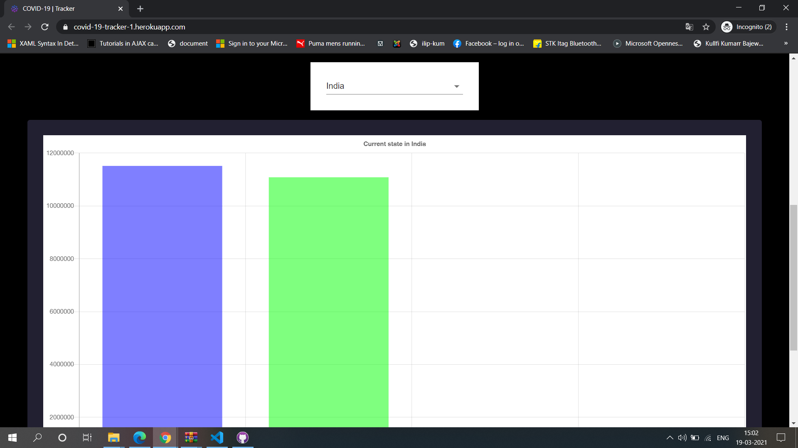

## Introduction
This is the covid tracker project in which we have taking the live data from the covid tracking api and every data count get update everytime as soon it is updated at the given api.
we have used the different endpoints of the api to show the data on the our webapp.
I have built this covid19 tracker using the reactjs.
## 🛠️ Built with

- [React](https://es.reactjs.org/) - Front-End JavaScript library
- [Material UI](https://material-ui.com/) - React UI Framework
- [react-chartjs-2](https://github.com/jerairrest/react-chartjs-2) - HTML5 Charts

## Installation

To setup the app for development on your local machine, please follow the instructions below:

1. Clone the repo to your machine

   ```bash
   git clone https://github.com/dilipkary/covid_19_tracker.git
   cd covid-19-tracker
   ```

2. Install packages

   If you use `npm`

   ```bash
   npm install
   ```

3. Run the development server

   If you use `npm`

   ```bash
   npm start
   ```
4. Visit <http://localhost:3000>

## [Live Demo](https://covid-19-tracker-1.herokuapp.com/)

## Screenshots of the live application
### screenshot1

### screenshot2

### screenshot3

### screenshot3


Don't forget to give a star :star: for this repo :slightly_smiling_face:
